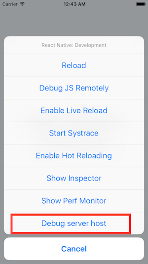
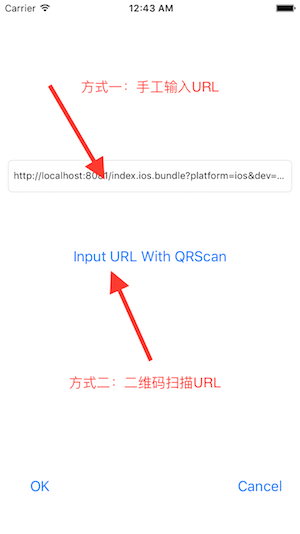

# Debug Server Host For iOS

## React Native服务器地址更换

运行时更换服务器地址，不用为更换调试服务器地址而频繁打包。android调试状态有更换服务器地址功能，而iOS不具备此功能，本库就是为iOS提供此功能。

## 安装

直接将DebugServerHost文件夹添加到项目中即可，无需任何设置。

## 使用

模拟器使用`Command+D`，真实设备使用摇一摇即可唤出调试菜单，选择最后一项`Debug server host`就可以修改服务器地址了。

有两种方式修改服务器地址：

1. 手工输入地址
2. 二维码扫描地址

推荐将url生成二维码，使用二维码扫描代替手工输入，点击OK时自动reload新服务器地址页面。

例如需要替换的服务器Url: `http://110.110.10.110:8081/index.ios.bundle?platform=ios&dev=true`，使用二维码生成工具将此Url生成二维码。使用调试工具中的`Input URL with QRScan`打开二维码扫描工具，扫描识别后自动填充到地址框，确认没有问题后点击OK，自动reload加载新地址。

## 运行Demo

Demo目录是React Native默认工程环境，用于演示DebugServerHost，删除了比较大的node_modules目录，但保留了package.json。

执行：`npm install`即可安装node_modules，打开iOS工程运行。

## 

